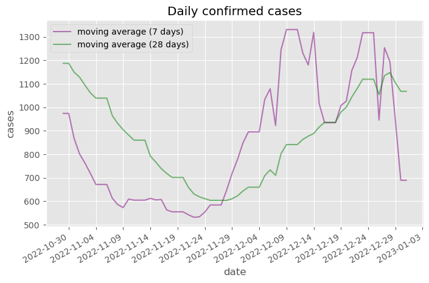
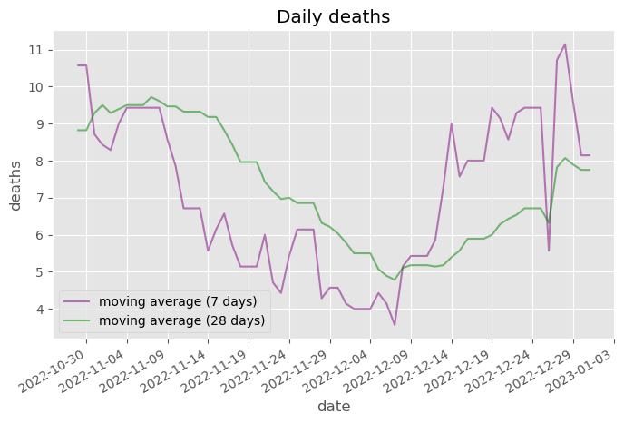
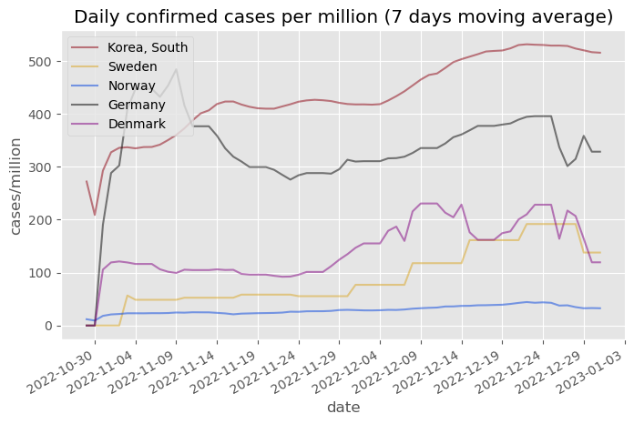

# How is Denmark doing?

## Denmark

## Confirmed cases compared

## Data

Data is from Johns Hopkins University: https://github.com/CSSEGISandData/COVID-19

Raw data for figures is available here: https://github.com/cboesgaard/how_is_Denmark_doing/blob/master/data/

