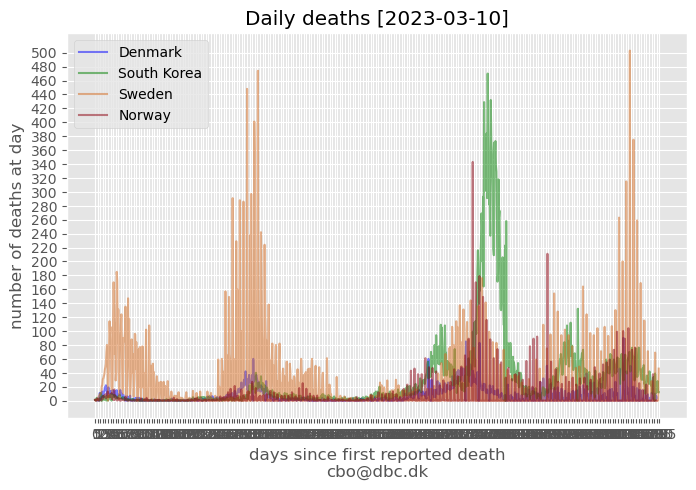
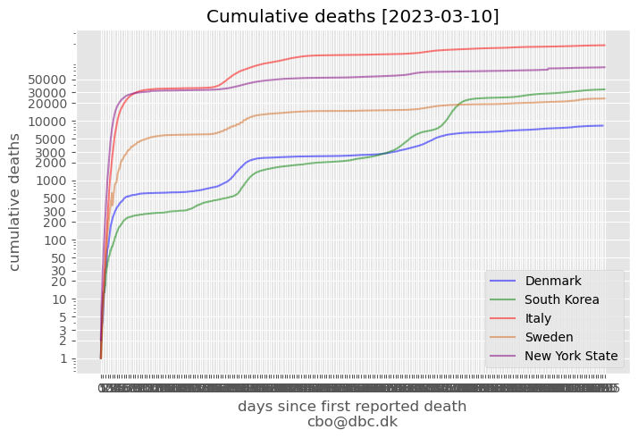
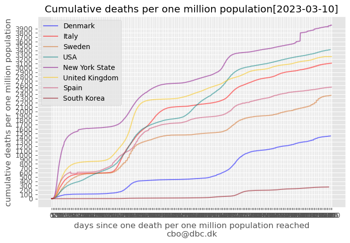

# How is Denmark doing?

## Hospitals

## Death compared

Data is aligned to start at the date of firste reported COVID-19 related death in the different countries. For Denmark day=0 was 2020-03-11 (the counting procedure has been changed).

## Death compared per one million population

## More visualizations

There are some very nice d3 plots showing these data at [challenge.dk/covid19/](http://www.challenge.dk/covid19/)

## Data

Danish data is from Statens Serum Institut (SSI): https://www.ssi.dk/aktuelt/sygdomsudbrud/coronavirus/covid-19-i-danmark-epidemiologisk-overvaagningsrapport

New York data is from The New York Times: https://github.com/nytimes/covid-19-data [(U. S. tracking page)](https://www.nytimes.com/interactive/2020/us/coronavirus-us-cases.html)

Other US data is from Worldometer: https://www.worldometers.info/coronavirus/country/us/

Other covid-19 data is from Johns Hopkins University: https://github.com/CSSEGISandData/COVID-19

Raw data for figures is available here: https://github.com/cboesgaard/how_is_Denmark_doing/blob/master/data/

Population data is from UNdata: [data.un.org](https://data.un.org/Data.aspx?d=PopDiv&f=variableID%3a12%3btimeID%3a83%2c84%3bvarID%3a2&c=2,4,6,7&s=_crEngNameOrderBy:asc,_timeEngNameOrderBy:desc,_varEngNameOrderBy:asc&v=1#PopDiv)

