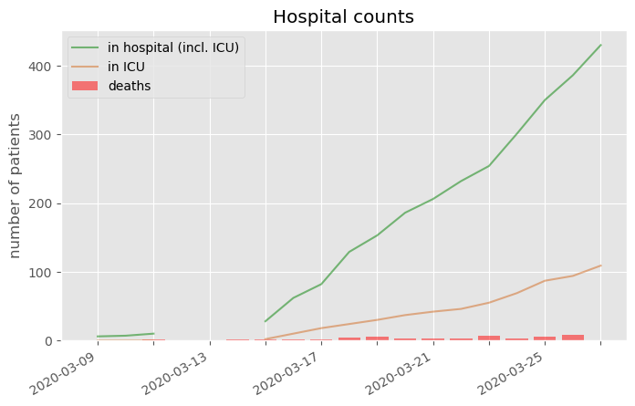
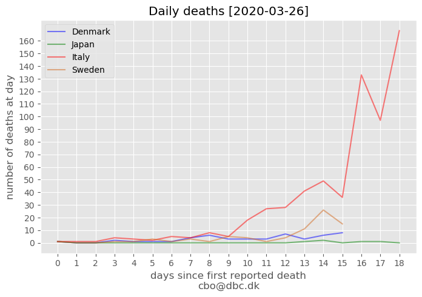
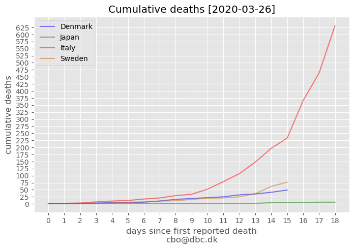

# How is Denmark doing?

## Hospitals

## Death compared

Data is aligned to start at the date of firste reported COVID-19 related death in the different countries. For Denmark day=0 was 2020-03-11 (the counting procedure has been changed).

## Data

Raw aligned data for figures: https://github.com/cboesgaard/how_is_Denmark_doing/blob/master/how_is_Denmark_doing.csv

Danish data is sourced from: https://www.sst.dk/coronadata

Other data is sourced from: https://github.com/CSSEGISandData/COVID-19

